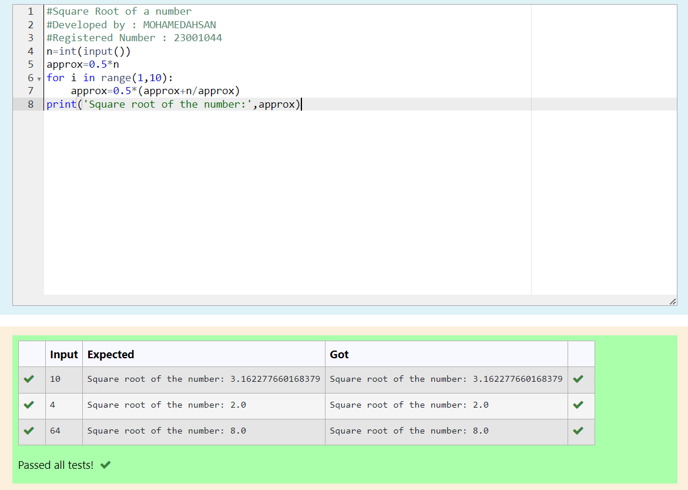

# Find the square root of a number

## AIM:
To write a program to find the square root of a number.

## Equipments Required:
1. Hardware – PCs
2. Anaconda – Python 3.7 Installation / Moodle-Code Runner

## Algorithm

### Step 1 : Define a function.

### Step 2 : Assign number_iters = 100 in the function to perform 100 iteratios.

### Step 3 : Set i = 0.

### Step 4 : Calculate  number = 0.5 * (number + a / number) for 100 iterations.

### Step 5 : Return number

## Program:
~~~
#Square Root of a number
#Developed by : MOHAMEDAHSAN
#Registered Number : 23001044
n=int(input())
approx=0.5*n
for i in range(1,10):
    approx=0.5*(approx+n/approx)
print('Square root of the number:',approx)
~~~

## Output:

## Result:
Thus the program to find the square root for the given number(newton's method) using function is written and verified using python programming.
